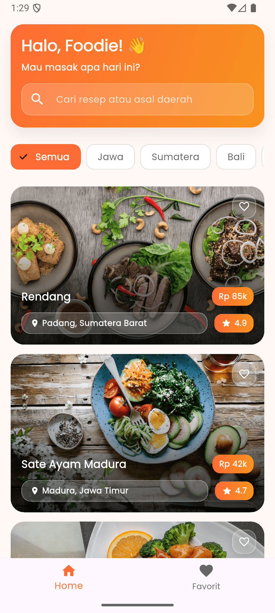
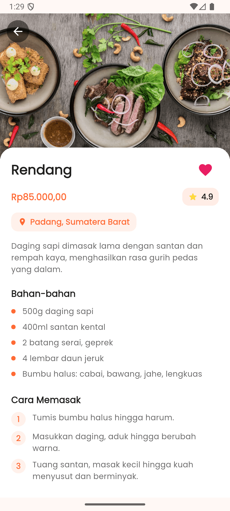
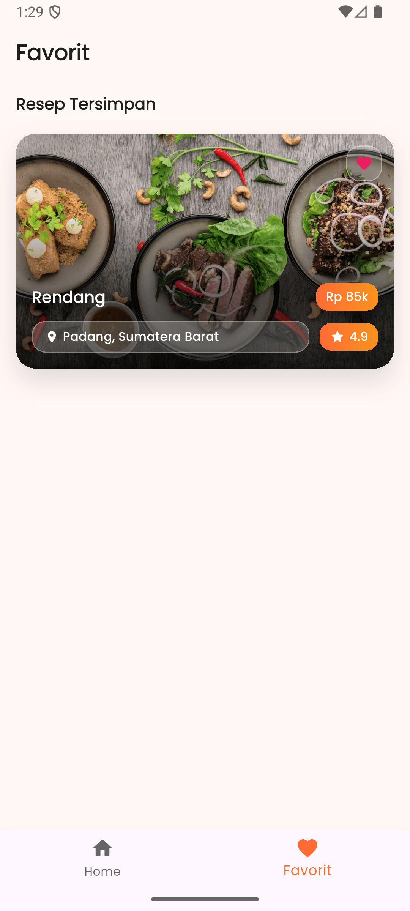

# 🍛 Nusantara Eats

<p align="center">
  
  
  
</p>

<p align="center">
  <b>Aplikasi katalog resep masakan tradisional Indonesia</b><br>
  Temukan, jelajahi, dan simpan resep kuliner Nusantara favoritmu! 🇮🇩
</p>

---

## 📱 Screenshots

<p align="center">
  
  
  
  
  
</p>

<p align="center">
  <i>Splash • Onboarding • Beranda • Detail Resep • Favorit</i>
</p>

---

## ✨ Fitur Utama

| Fitur                      | Deskripsi                                                   |
| -------------------------- | ----------------------------------------------------------- |
| 🏠 **Beranda Modern**      | Tampilan card vertikal dengan gradient overlay yang menarik |
| 🔍 **Pencarian Real-time** | Filter resep berdasarkan nama atau asal daerah              |
| 🏷️ **Kategori Regional**   | Filter cepat: Jawa, Sumatera, Bali, Jakarta                 |
| ❤️ **Favorit**             | Simpan resep favorit untuk akses mudah                      |
| 🎬 **Hero Animation**      | Transisi gambar yang halus antar halaman                    |
| 📱 **Responsive**          | Tampilan optimal di portrait & landscape                    |
| ✨ **Animasi Staggered**   | Efek animasi saat scroll untuk UX premium                   |
| 🚀 **Onboarding**          | Panduan awal untuk pengguna baru                            |

---

## 🍜 Koleksi Resep

Tersedia **10 resep** masakan Nusantara lengkap dengan bahan dan langkah memasak:

| No  | Masakan             | Asal Daerah                 |
| --- | ------------------- | --------------------------- |
| 1   | 🥩 Rendang          | Padang, Sumatera Barat      |
| 2   | 🍢 Sate Ayam Madura | Madura, Jawa Timur          |
| 3   | 🍚 Nasi Goreng      | Jakarta                     |
| 4   | 🍲 Gudeg            | Yogyakarta                  |
| 5   | 🍜 Soto Betawi      | Jakarta                     |
| 6   | 🥗 Gado-Gado        | Jakarta                     |
| 7   | 🐟 Pempek           | Palembang, Sumatera Selatan |
| 8   | 🥣 Rawon            | Surabaya, Jawa Timur        |
| 9   | 🍡 Bakso Malang     | Malang, Jawa Timur          |
| 10  | 🐔 Ayam Betutu      | Bali                        |

---

## 🏗️ Arsitektur Proyek

```
lib/
├── main.dart                 # Entry point aplikasi
├── theme/
│   └── app_theme.dart        # Tema aplikasi
├── models/
│   └── recipe.dart           # Model data resep
├── data/
│   └── recipe_data.dart      # Koleksi 10 resep
├── screens/
│   ├── splash_screen.dart    # Splash dengan gradient
│   ├── onboarding_screen.dart# 3 halaman onboarding
│   ├── main_navigation.dart  # Bottom navigation
│   ├── home_screen.dart      # Beranda dengan search
│   ├── favorites_screen.dart # Daftar favorit
│   └── detail_screen.dart    # Detail resep
├── widgets/
│   ├── recipe_card.dart      # Card modern dengan overlay
│   ├── category_chip.dart    # Chip filter kategori
│   ├── rating_widget.dart    # Widget bintang rating
│   └── ingredient_item.dart  # Item daftar bahan
└── services/
    └── favorite_service.dart # Persistence favorit
```

---

## 📦 Dependencies

| Package                        | Fungsi                     |
| ------------------------------ | -------------------------- |
| `google_fonts`                 | Typography Poppins         |
| `cached_network_image`         | Cache gambar               |
| `shared_preferences`           | Menyimpan state onboarding |
| `flutter_staggered_animations` | Animasi list/grid          |
| `shimmer`                      | Loading placeholder        |
| `intl`                         | Format mata uang Rupiah    |

---

## 🚀 Cara Menjalankan

### Prasyarat

- Flutter SDK 3.10+
- Android Studio / VS Code
- Emulator atau device fisik

### Langkah Instalasi

```bash
# 1. Clone repository
git clone https://github.com/username/nusantara_eats.git

# 2. Masuk ke direktori
cd nusantara_eats

# 3. Install dependencies
flutter pub get

# 4. Jalankan aplikasi
flutter run
```

---

## 🎨 Design System

### Palet Warna

| Warna             | Hex       | Kegunaan            |
| ----------------- | --------- | ------------------- |
| 🟠 Primary        | `#FF6B35` | Tombol, aksen utama |
| 🟡 Accent         | `#FFD93D` | Rating bintang      |
| ⬜ Background     | `#FFF8F5` | Latar belakang warm |
| ⬛ Text Primary   | `#1F1F1F` | Judul               |
| 🔘 Text Secondary | `#666666` | Deskripsi           |
| ❤️ Heart Red      | `#E91E63` | Favorit             |

### Typography

- **Heading:** Poppins Bold
- **Body:** Poppins Regular

---

## ✅ Checklist Submission

- [x] Aplikasi berjalan tanpa error
- [x] Navigasi Home ↔ Detail lancar
- [x] Hero Animation halus
- [x] Favorite toggle berfungsi
- [x] Tidak ada overflow di landscape
- [x] Kode bersih dan terstruktur
- [x] StatelessWidget & StatefulWidget tepat
- [x] ListView.builder digunakan
- [x] Responsive layout

---

## 📄 Lisensi

Proyek ini dibuat untuk keperluan pembelajaran dan submission.

---

<p align="center">
  Dibuat dengan ❤️ menggunakan Flutter<br>
  <b>Nusantara Eats</b> © 2025
</p>
